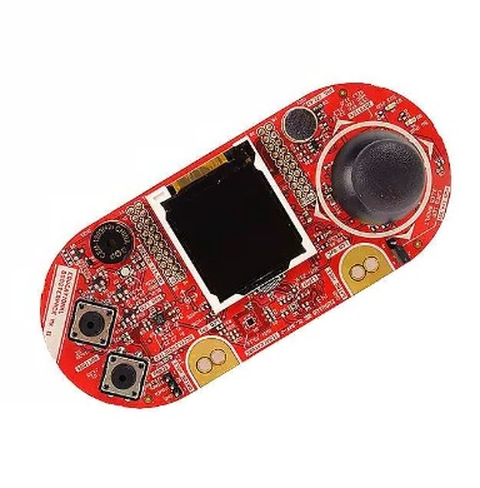
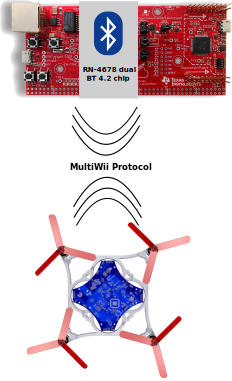

#### MES-1 Quadcopter Project

In this project (A first Semester Master Studies at FH Technikum Wien) a remote controller  is implemented for Infineon’s [flying-PCB](https://www.infineon.com/cms/en/applications/consumer/multicopters/) quadcopter.
Furthermore, there exists an Android app that can be used to fly the pcb.

#### Project Setup
image::Docs/joystick_edumKII.jpg[Embedded,300,opts=inline]

#### Hardware Overview
The remote controller’s hardware platform must be the TM4C1294NCPT used throughout this course.
You will use the RN4678 dual mode bluetooth transceiver already housing a complete bluetooth 4.2 and
bluetooth low energy stack that is interfaced via UART to talk to the flying PCB. The flying PCB’s
firmware wants you to use the [MULTI WII](http://myrobotlab.org/service/multiwii) flight controller protocol. Additional documentation regarding
the communication protocol to can be found [here](http://www.multiwii.com/wiki/index.php?title=Multiwii_Serial_Protocol). The user interface will be realized
using a Texas Instruments Educational Boosterpack MKII offering various interface capabilities.

####  Documentation
Three different documentations were generated in the documentation folder [doxygenDocs](https://github.com/ic16b011/copter_project/tree/quadcopter_base_public/doxygenDocs)

1. [html](https://github.com/ic16b011/copter_project/tree/quadcopter_base_public/doxygenDocs/html)
2. [man](https://github.com/ic16b011/copter_project/tree/quadcopter_base_public/doxygenDocs/man)
3. [rtf](https://github.com/ic16b011/copter_project/tree/quadcopter_base_public/doxygenDocs/rtf)

== Video Demo

